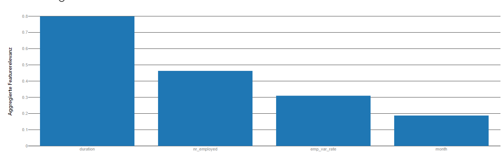

# Optimizing an ML Pipeline in Azure

## Overview
This project is part of the Udacity Azure ML Nanodegree.
In this project, we build and optimize an Azure ML pipeline using the Python SDK and a provided Scikit-learn model.
This model is then compared to an Azure AutoML run.

## Summary
The goal of this project was to collect experience in developing a prediction model which is able to predict the likeliness of success of the sale of a fix term deposit in a bank marketing campaign. The dataset provided by Microsoft was originally provided by the Center for Machine Learning and Intelligent systems and further details can be found here:

https://archive.ics.uci.edu/ml/datasets/bank+marketing

## Scikit-learn Pipeline

I used SciKit's Logistic Regression model as it's already very well integrated in Azure's HyperDrive.

The algorithm receives a table of input features and a binary target label and provided in form of a single Python script file - train.py - into which HyperDrive passes all parameters in form of command line parameters.

As the goal was only to train a quite simple binary, logistic regression model I sticked to the parameters already provided in the base code - the number of iterations after which the training process should definitely stop and the the inverse regularization strength C, further described here:

https://scikit-learn.org/stable/modules/generated/sklearn.linear_model.LogisticRegression.html

A value of 1.0 for C means that no regularization is applied at all where as values such as 0.5 would already present a very intense regularization definitely excluding all feature which just have a very small impact on the outcome while taking care that single features don't dominate by penalizing features with very high influence. I provided HyperDrive discrete selection of the following parameters:
1.0, 0.95, 0.9, 0.8, 0.5, 0.1, 0.001, 0.001

I assumed that either 0.95 or 0.9 would win the race for the best hyperparameters and this was also the case. Values such as 1.0, so no regularization at all, overfit usually very intense where as values such as 0.5 and below usually bias the model too much. I passed them though as well to find out how good or bad the algorithm will still perform and it actually still did very very well even with a very high regularization value such as 0.5.

For the count of iterations I chose 50, 100 and 200 maximum iterations. To my surprise the hyperparameter config with 100 iterations proved as the best - I had assume it would take less turns.

As early stopping policy I chose the BanditPolicy with a slack factor of 0.1 and an evaluation each round,
delayed for the first 5 iterations. The BanditPolicy stops the training as soon as the performance drops
below 10% of the best model after 5 iterations.

The best model achieved in accuracy of 91.3831% after 100 training iterations and using an inverse regularization value of 0.95.

## AutoML
The Azure AutoML task for logistic regression tried overall 29 different model and hyperparamter combinations including RandomForest, LightGBM, ExtremeRandomTreets, XGBoost, StackEnsemble, GradientBoosting, a simple LogisticRegression as we used it via SciKit and a VotingEnsemble.

The setup of the pipeline itself was rather easy - you have to define a task, in our case a classification, the main metric, to be able to compare the performance we optimized for accuracy here as well, the dataset
to use, the column in it which represents your target label and optionally the compute cluster to use for the AutoML job.

The original notebook of this exercise did not use a compute cluster but executed the AutoML job locally. As this is of course far from reality I changed the configuration to use my previous created cluster for the job. Unfortunately but not surprisingly this did not work anymore with a locally, memory resident Pandas dataframe as it was solved in the example code.

But after some authorization hurdles I managed to upload the cleaned data as temporary Pandas dataframe via TabularDataSetFactory.register_pandas_dataframe to make it available to the whole cluster and could execute the AutoML jobs at scale. Overall the ML job ran for 42 minutes.

The best forming model was a Voting Ensemble with an accuracy of 91.684%.

A great benefit of AzureML was that it did not just provide a ready-to-use model but also the possibility to analyze why this model performed better in which features had the biggest influence on the outcome.

Using the code provide the most important feature was the duration of the call. Less surprising of course that someone who wants to sign a contract stays for more seconds on the phone than someone who is not interested at all and hangs up more or less instantly. Because of that this feature should have been deleted for a real feature benchmarking as it is proposed by CMLIS. The second and third most important features are the repetition of the calls on the one hand while varying the employer on the other.

## Pipeline comparison
Less surprisingly the AutoML model performed slightly better than the straight forward SciKit Logistic regression approach - it is simply able to brute force a large variation of different model and hyperparameter combinations on the one hand but most importantly can let Azure choose beforehand the likely best performing algorithms based on a dataset analysis.

In reality you usually though don't start with such a clean dataset and usually the biggest share of the work is to clean the data and engineer the features to such a level in the first place. Anyways I will definitely try AzureML in future projects again as nothing is more valuable the your worktime... and there of AzureML can save a lot.

## Future work
As already mentioned in the upper section it was actually not intended by the authors to involve the **duration** feature in a real benchmark - after all you just know this value after the call is already done. Training the models again without this feature will likely perform far worse. I assume though that this was the intention of Udacity and Microsoft to simply make it easier for the students to experiment and to a bigger success feeling when the output shows an accuracy of over 90% rather than 75% or below. If I had to increase this accuracy I would like to further enhanced my knowledge about each customer e.g. by adding geographical information such as average neighborhood income.
