# Training & Deployment of Machine Learning Models using Azure Machine Learning 

With the help of Azure Machine Learning and Azure AutoML you can effectively train machine learning models with a minimum amount of code and provide it's knowledge to other employees in your company by providing this as http service with just a couple of clicks. One business case for such a scenario could be if a company would want to increase the effectiveness of marketing calls by using historical data stored in a database where each call in the past lists all known details about a specific customer such as his loans and the success of the call to then determine which future phone calls have the highest chance of success.

**Architectural Diagram**

Below you can see the workflow of a simple AutoML process as we used it in this project. It has 6 major steps:

1. Register your data in form of an Azure ML tabular dataset. You can for example upload a dataset manually by providing a local CSV file or source URL or of course use scripting languages such as Python to upload preprocessed data for example in form of a CSV file or of course also directly from a Pandas DataFrame, a typical in-memory storage method for tabular data in Python.
2. Setup a compute cluster either manually or from within a script. A compute cluster defines a set of virtual machines, so a group of virtual computers which will later calculate several different machine learning models. The higher your budget the larger you can configure such a cluster, the smaller your budget, the smaller you can configure it. If time is not pressing it's though recommend to use a medium sized cluster with low priority, this means that a non-finished calculation might be cancelled... and will have to be repeated but in exchange Microsoft provides you the same performance for often less than one fourth of the original price... so even if two of four jobs would be cancelled, what is usually not the case, you would still save a lot of money. I have never experienced a canceled run though this could of course happen for long training runs such as large deep learning models often training for hours.
3. Configure an AutoML run - which Dataset do you want to use and which column of this set is the one you want to predict? Do you want to do a classification, e.g. predict between Spam/Not Spam or Success/No Success? A regression, e.g. the estimated revenue for a given day or the bottles of water you will need in the storage of your restaurant? Or estimate a time series? How much time/money do you want to spent on the optimization, how many cross validations of data chunks you want to execute? And on which compute cluster shall it be executed?
4. Once these parameters are defined you can either start an AutoML run by configuring a pipeline in a Python script in which you add an AutoML-step, containing the details defined in step 3 to either execute it directly from within the script or provide it as http endpoint which could for example be triggered by a continuous integration script. Alternatively you can also go in the AutoML section in the Azure Portal, define the parameters in step 3 there manually or start a run from there.

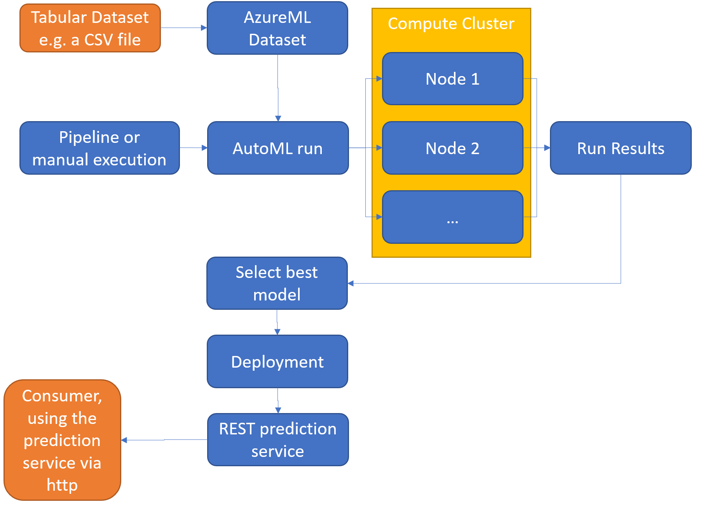

5. The work is now shared across the compute clusters and computes several different model approaches and hyperparameters in parallel. Which models are tried is for example determined by the pre-analysis which is executed after we uploaded the Dataset in step 1 such as the number of rows or the number of different categories in each feature.
6. When all different approaches have been executed or our budget limit has been reached our run results are stored in a so called Run. The Run contains a list of all models and their performance of which we will now select the best performing model. Optionally you can also request that AzureML explains to you why the model performed as good as it does and which columns/features had the biggest impact on the prediction.
7. Once again either programmatically or manually we now select the best model and **deploy** it. This means we let it get bundled with a set of Python scripts hosting a http server and documentation files such as a swagger.json documenting how to later interact with the interface - so which parameters are required and which outputs will be returned for the different commands. This package of Python scripts and model can either be deployed using Kubernetes or Azure Container Instances. ACIs are the even more managed variants and allow us to now deploy the model with either a few lines of code or four further clicks.
8. Using ACI model endpoint is available after just a few minutes of time. The endpoint provides us the http URL we need to call to execute an inference and a set of two keys for the authentication. This endpoint we can now for example use in Python. A non-developer could though also directly make use of the script from within Excel as well with help of the AzureML plugin. When planning our next marketing campaign we can now call our http endpoint from Python with a simple Post-request containing all data we have about the customers we would potentially like to call in the next campaign. This data is provided in form of a list of table rows in the JSON format. This with our password key in the header we can now send the our http endpoint using a post request and will receive the model's predictions in exchange.

## Key Steps

https://docs.microsoft.com/en-us/azure/machine-learning/how-to-setup-authentication

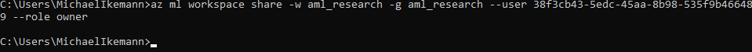

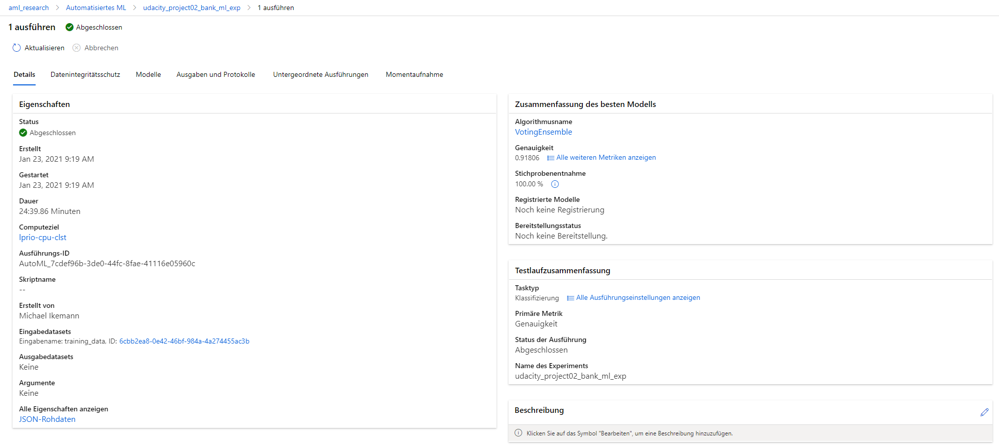

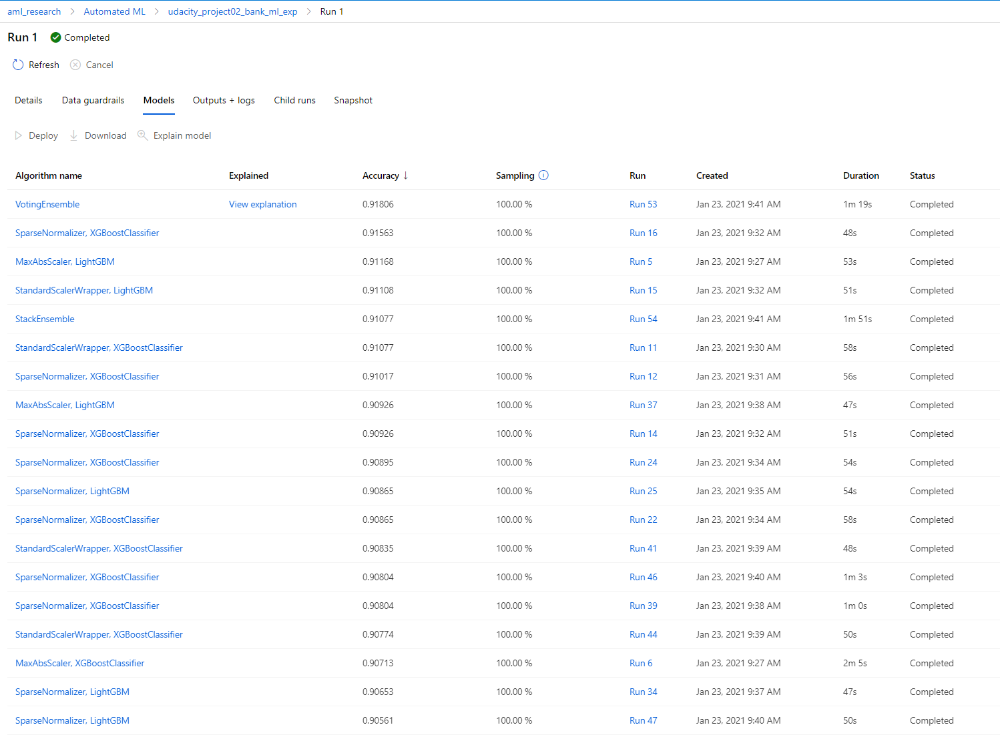

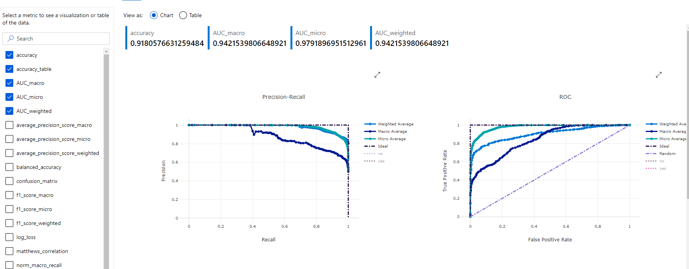

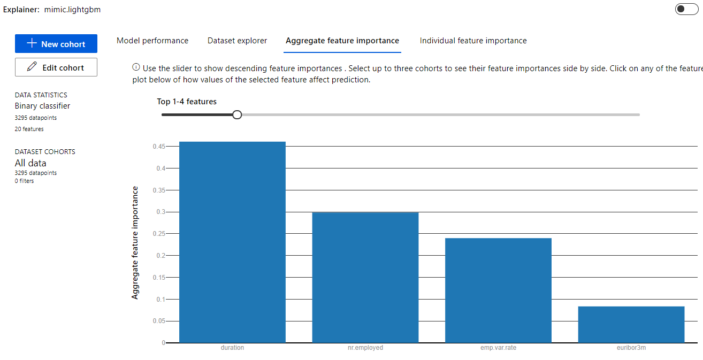

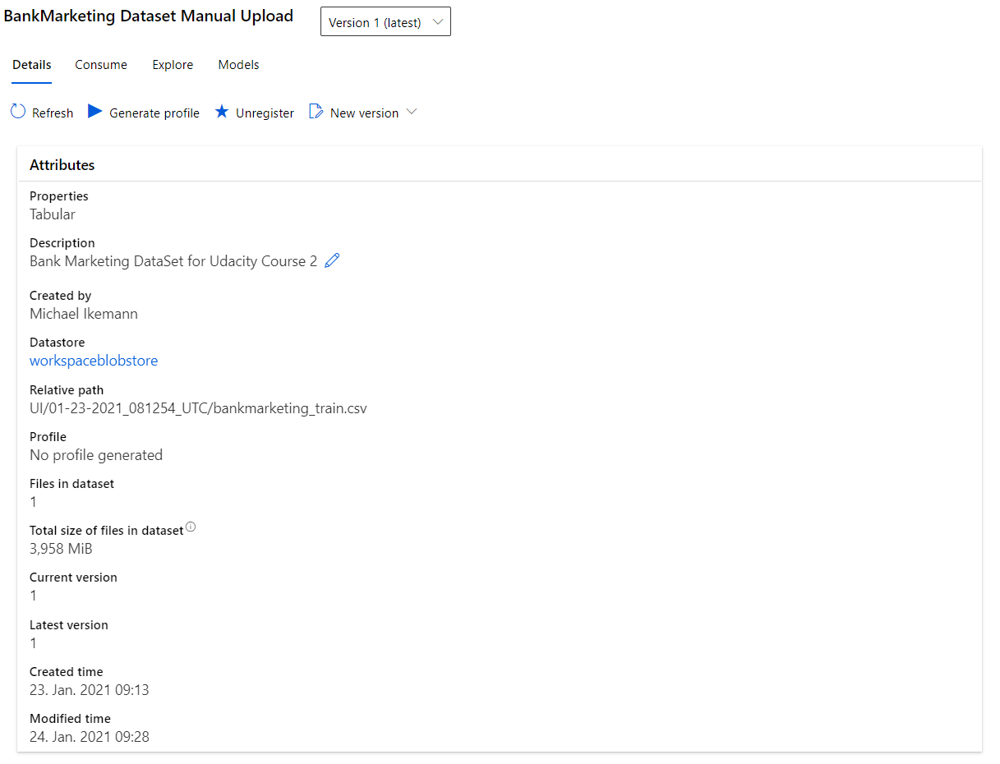

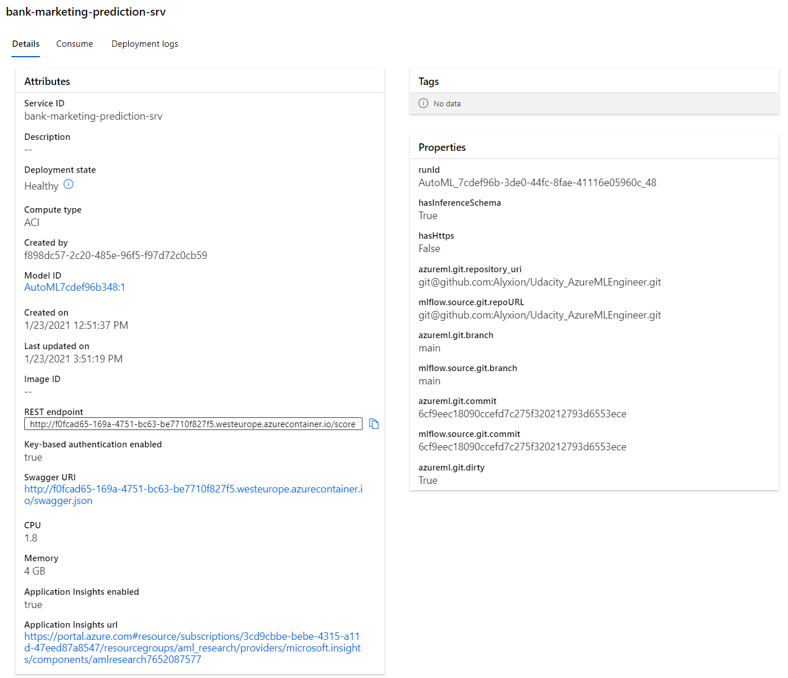

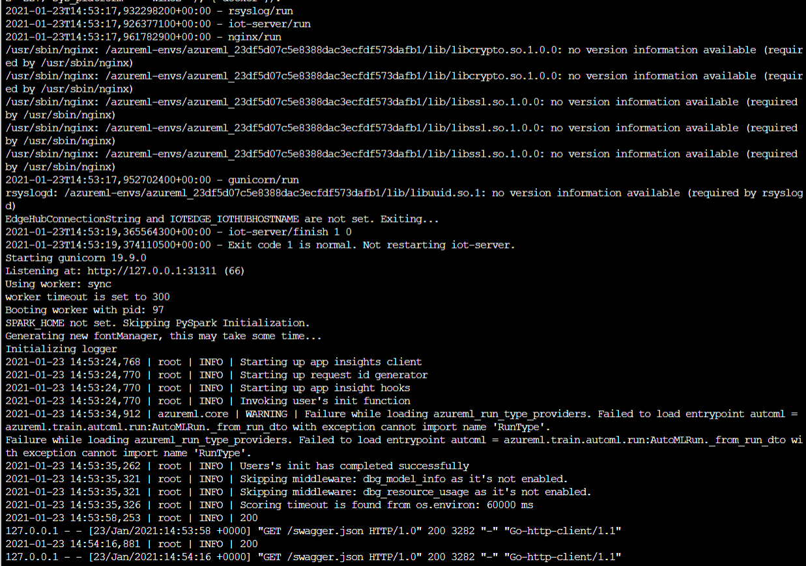

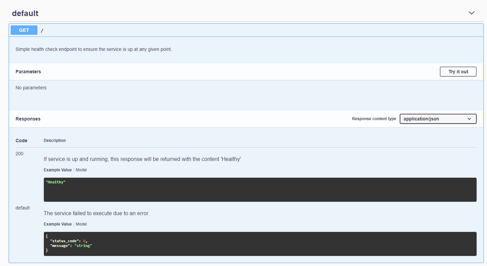

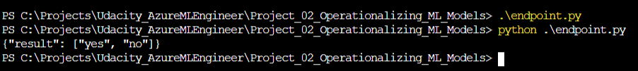

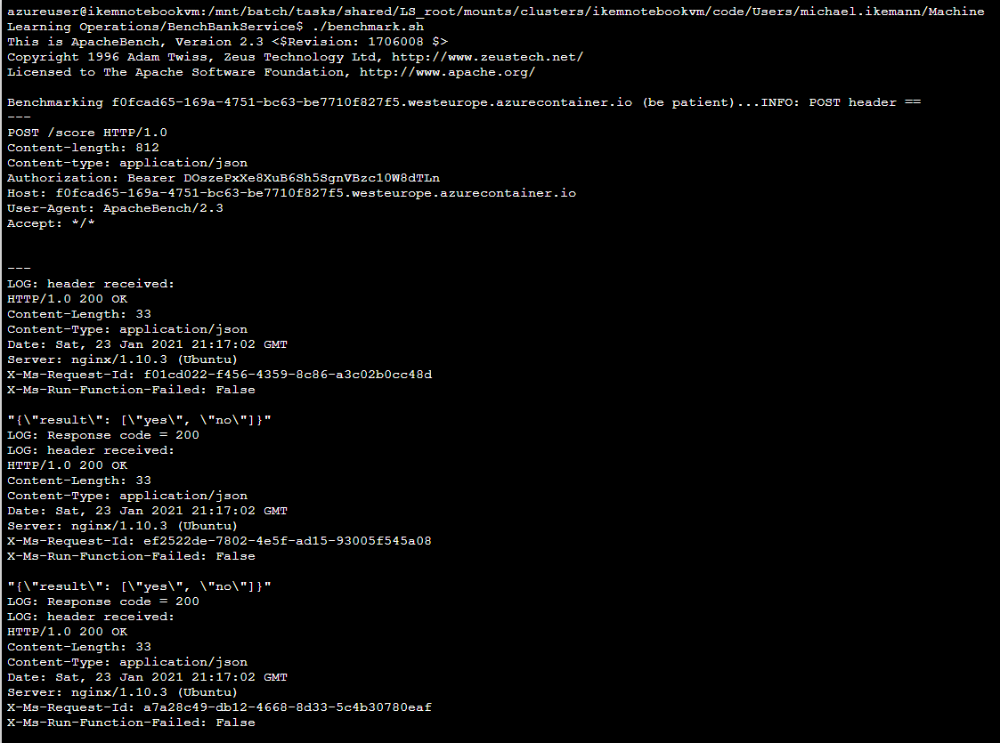

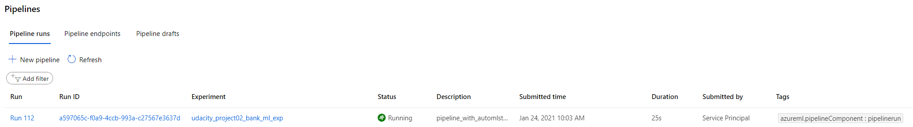

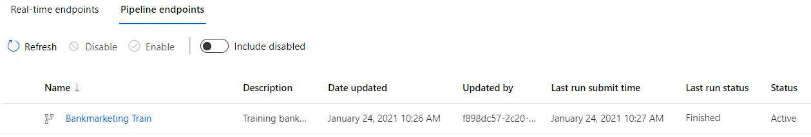

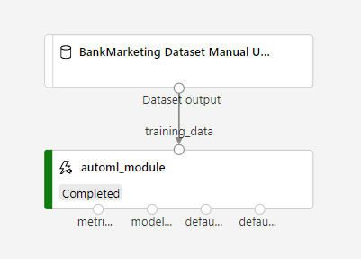

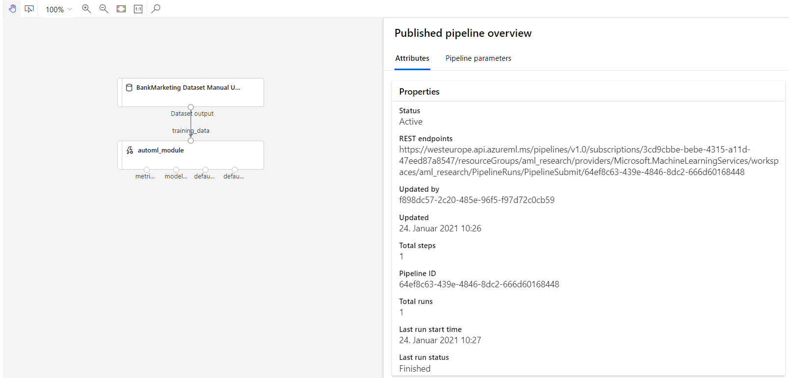

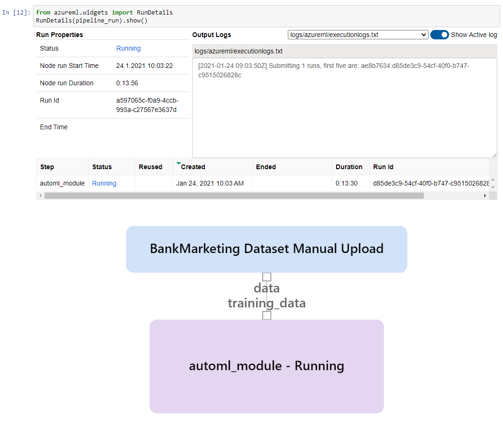

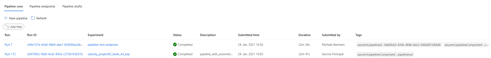

## Screen Recording

You can find my presentation about how to train and consume an Azure AutoML model here:

https://youtu.be/KtSnKpJ8QWQ

