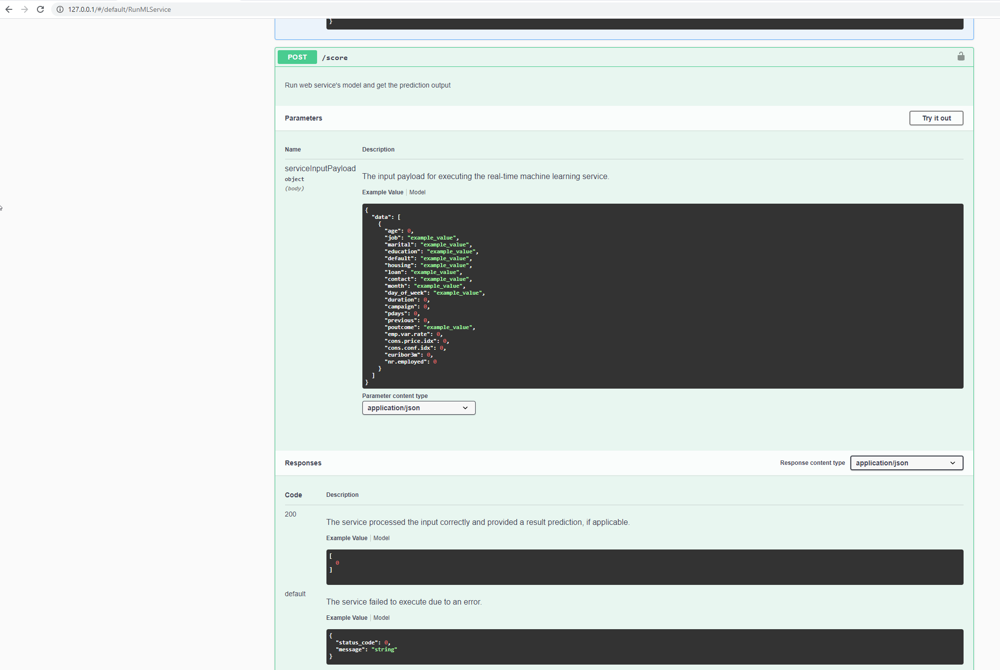

# Training & Deployment of Machine Learning Models using Azure Machine Learning 

With the help of Azure Machine Learning and Azure AutoML you can effectively train machine learning models with a minimum amount of code and provide the model's insights to other employees in your company by providing an inference http service with just a couple of clicks. One business case for such a scenario could be if a company would want to increase the effectiveness of marketing calls by using historical data stored in a database where each call in the past lists all known details about a specific customer such as his loans and the success of the call to then determine which future phone calls to similar customers have the highest chance of success.

**Architectural Diagram**

Below you can see the workflow of a simple AutoML process as we used it in this project. It has 8 major steps:

1. **Register your data** in form of an Azure ML tabular dataset. You can for example upload a dataset manually by providing a local CSV file, a source URL or of course use scripting languages such as Python to upload preprocessed data in form of a local file or of course also directly from a Pandas DataFrame, a typical in-memory storage method for tabular data in Python.
2. **Setup a compute cluster** either manually or from within a script. A compute cluster defines a set of virtual machines, so a group of virtual computers which will later calculate several different machine learning models. The higher your budget the larger you can configure such a cluster, the smaller your budget, the smaller you can configure it. If time is not pressing it's though recommend to use a medium sized cluster with low priority, this means that a non-finished calculation might be cancelled... and will have to be repeated but in exchange Microsoft provides you the same performance for often less than one fourth of the original price... so even if two of four jobs would be cancelled, what is usually not the case, you would still save a lot of money. I have never experienced a canceled run though this could of course happen for long training runs such as large deep learning models often training for hours.
3. **Configure an AutoML run**- which Dataset do you want to use and which column of this set is the one you want to learn to predict? Do you want to do a classification, e.g. predict between Spam/Not Spam or Success/No Success? A regression, e.g. the estimated revenue for a given day or the bottles of water you will need in the storage of your restaurant? Or estimate a time series? How much time/money do you want to spent on the optimization, how many cross validations of data chunks you want to execute? And on which compute cluster shall it be executed?
4. Once these parameters are defined you can either **start an AutoML run** by configuring a pipeline in a Python script in which you add an AutoML-step, containing the details defined in step 3 to either execute it directly from within the script or provide it as http endpoint which could for example be triggered by a continuous integration script on a daily basis. Alternatively you can also go to the AutoML section in the Azure Machine Learning Workspace in your browser, define the desired parameters there manually and start a run from there.

5. Once the AutoML job is started the work is shared across the **compute cluster** and **computes several different model approaches and hyperparameter combinations** in parallel. Which models are tried is for example determined by the pre-analysis which is executed after we uploaded the Dataset in step 1 such as the number of rows or the number of different categories in each feature.
6. When all different approaches have been executed or our budget limit has been reached **an overview of our run results are stored in a so called Run**. The Run contains a list of all models and their performance of which we will now **select the best performing model**. Optionally you can also request that AzureML explains to you why the model performed as good as it does and which columns/features had the biggest impact on the prediction.
7. Once again either programmatically or manually we now select the best model and **deploy** it. This means we let it get bundled in a container with a set of Python scripts hosting a http server and documentation files such as a swagger.json documenting how to later interact with the http services - so which parameters are required for the inference and which outputs will be returned for the different commands. This package of Python scripts and model can either be deployed using Kubernetes or Azure Container Instances. ACIs are the even more managed and allow us to deploy the model with either just a few lines of code or four further clicks.
8. Using an ACI model for our endpoint **the inference service** is already after just a few minutes **ready to be consumed**. The endpoint provides us the http URL we need to call to execute an inference and a set of two keys for the authentication of which we can choose one. This endpoint we can now for example use in Python via the requests library. A non-developer could though also directly make use of the script from within Excel as well with help of the AzureML plugin. When planning our next marketing campaign we can now call our http endpoint from Python with a simple Post-request containing all data we have about the customers we would potentially like to call in the next campaign. This data is provided in form of a list of table rows in the JSON format. All we still need to do now is to provide this JSON object as payload, provide the authentication key in the header and trigger a POST http call to our inference URL. The result of a call is a list of predictions - containing one response entry for each table row we passed to the call.

## Key Steps

Here you can find a set of screenshots showing the major technical steps when using a script based approach.

Before diving into the world of Python we first of all set up a Service Principal and grant it permissions over our AzureML workspace. A Service Principal basically behaves quite similar to a user who logins with his password. We can grant him a specific set of permissions so the Service Principal can later create ML experiments, pipelines, set up compute clusters or execute machine learning model trainings and deployments without any manual interaction or authentication of a human user once everything is configured:

https://docs.microsoft.com/en-us/azure/machine-learning/how-to-setup-authentication

In the next step visualized here we first uploaded a CSV file of a bank phone marketing campaign which contains data about how successful marketing calls to specific of customers were in the past.

Next we setup a compute cluster and start an AutoML run as described above to let Azure find the best model predicting the success of marketing calls in the history dataset, stored in it's column y.

After around 30 minutes of trying different approaches it turned out that a VotingEnsemble could predict the success chance most effectively.

Next to the overall performance of a model Azure provides us several details about the model it produced such as the importance of individual features or the perfect threshold between the choices of a classification shown below as curve.

Now we can to use our model to optimize our future campaign. To do so we make it accessible in form of an http endpoint hosted in an Azure Container Instance. (ACI) In the consume tab we can find the URL of our endpoint and the associated authorization key we will now store in a JSON file for later use.

To verify the service's health status and that no errors occurred in the provision process we enabled Application Insights and fetched the deployment logs from a Python script. The output you can see below:

Next to the service itself Azure provides a so called swagger file for each service endpoint. This file can be viewed or loaded in Swagger to get an overview of the methods provided, which parameters they await and which outputs they return.

Once we have investigated the documentation we are finally ready to test our endpoint. To do we load the JSON file containing the endpoint's URL and authorization key and send a set of example table data entries, converted to JSON to our http REST endpoint. Below you can see that the call executed successfully and that our model predicted a likely successful marketing call to our first test customer and a likely not successful one for our second customer.

As a single response does not proof that our service is ready for use in production we will now use the same URL, data and key previously used in our Python script and let it sent by the application Apache Benchmark to our endpoint to measure the response time and to detect potential failure responses.

To not just make use of an old dataset but to be able to recalculate our model every night with new incoming data we also register our pipeline and create as well an http rest endpoint which can be called when ever the dataset has been updated.

Below you can see the details of such a published endpoint. When ever the URL below is called by an authorized user the complete AutoML process will be repeated automatically.

The current progress of the execution of the AzureML job you can always follow live from within the Azure Notebook. It also contains hyperlinks which bring you directly to the result pages in the Azure Machine Learning portal.

In the pipeline runs overview you can also follow the process of your pipeline from within the Azure Portal to see if the pipeline is still being executed, finished or failed:

## Screen Recording

You can find my presentation about how to train and consume an Azure AutoML model here:

https://youtu.be/KtSnKpJ8QWQ

## Future improvements ##

The current dataset being used for the AutoML process does next to the success of the call still contain the call's duration. As this is also an information you can now know in advance it should be removed from the table data before using it to train the model. In addition the current dataset is very clean and some features may not be available for every customer. A great improvement for the endpoint were definitely if just a small set of features would need to be provided and all other features could automatically be estimated. This could for example be done in form of a custom inference script.