# Azure Machine Learning Engineer Nanodegree Capstone Project

### Azure AutoML vs Data Engineer + Data Scientist

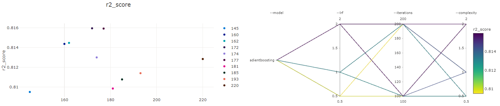


In this final project of the **Azure Machine Learning Nanodegree** our goal was to 

1. **Select a dataset** of our choice in which we can make use of Azure AutoML, e.g. for a regression task such as estimating the revenue of a shop - a classification task by for example estimating the likeliness of fraud or a time series prediction for example for estimating the development of stocks or the behavior of a machine.
2. **Make use of Azure AutoML**, a technique in which you basically just need to provide an Excel table like data structure, to automatically find a model which can predict the insights we would like to have, e.g. the revenue of our shop next week. Even if this is completely doable without any programming knowledge we had to solve this task programmatically so our outcome could easily be reused and majorly be used in an automated environment such as a CI/CD solution.
3. Train a machine learning model manually by using a framework such as Keras, Tensorflow or SciKit-Learn and try to find the best hyperparameters (configuration switches if you want so) by calculating a model multiple times with different parameters in parallel using a technique named **Azure Hyperdrive**. The right choice of hyperparameters such as the learning rate or neural network dimension which have a large influence on the success of the model.
4. **Deploying both variants as a web service and testing them** so our company could benefit from our solution e.g. by using it from a website it or integrating it in solutions such as Excel or PowerBI.
5. **Comparing** both variants to each other

In addition to these tasks I also tried to make use of Azure AutoML like one with no background in Data Science or Data Engineering, so a typical Excel user for example working for a bank, would likely use it and evaluate how much of the promise, not just of Microsoft but of AutoML providers in general, often saying in their shiny presentations "Just throw in your historical data and AutoML is so intelligent, it does all the rest for you." So I tried to let AutoML figure out by itself how to "engineer" the data by providing it the real, dirty data as it was recorded by the FHFA in the National Mortgage Database.


----


## Project Set Up and Installation

## Preparing the environment and dataset

- Create an Azure Machine Learning workspace named **"aml_research"**. A step by step guide can be found here: 
  - https://docs.microsoft.com/en-us/azure/machine-learning/how-to-manage-workspace?tabs=azure-portal#create-a-workspace
- Create an **Azure Compute Instance** of type Standard_DS3_V2
- Open Jupyter Notebook once the compute instance is ready
- Open a terminal in the default AzureML 3.6 environment by clicking New -> Terminal in the upper right corner of Jupyter Notebook
- Install seaborn via `pip install seaborn`
- Setup a **Service Principal** and make notes of the **clientId, clientSecret, tenantId, subScriptionId** and the **resource group**'s name:
  - https://docs.microsoft.com/en-us/azure/machine-learning/how-to-setup-authentication
- Fetch this repo from GitHub via `git clone https://github.com/Alyxion/Udacity_AzureMLEngineer`
- Enter the directory **Project_03_Capstone** via `cd Project_03_Capstone`
- Execute the first script **ProvisionDataSets.py** via `python ProvisionDataSets.py`. It will complain about a missing **Config/ml_principal.json** and will automatically create it for you.
- Open the file named for example also in Jupyter and fill in these values accordingly in the file path it shows to you in the notebook. You should have made note all of them in the Service Principal setup.
    `"clientId": "f898dc57-2c20-485e-96f5-XXXXXXXXXX",`
    `"clientSecret": "n~Ip4XXXXXX12gCwJXXXXXX_sxuED338xl",`
    `"subscriptionId": "3cd9cbbe-XXXX-4315-a11d-47eed87a8547",`
    `"tenantId": "12b8031c-fe22-XXXX-a54f-43dc40076af1",`
    `"resourceGroup": "aml_research"`
- Execute the Python script **ProvisionDataSets.py** via `python ProvisionDataSets.py` again. If everything was set up correctly it will store three datasets in the AzureML workspace, named
	- **UncleanedMortgageSpread** - The original dataset once provided for the Microsoft Professional Program for Data Science.
	- **EngineeredMortgageSpread** - The original dataset enhanced with lots of row-wise statistics such as the average rate spread in each county, state etc.
	- **EngineeredMortgageSpreadNoLenderSpread** - With slightly reduced statistics.
- All sets can be found in the directory data in form of CSV files or here:
	-  https://github.com/Alyxion/Udacity_AzureMLEngineer/tree/main/Project_03_Capstone/data
  


---


## Dataset


https://github.com/Alyxion/MPPDataScience/blob/master/MPP_DS_FinalReport.pdf


### Overview
I used data from the National Mortgage Database managed by the Federal Housing Finance Agency about which you can find more information here: 

https://www.fhfa.gov/PolicyProgramsResearch/Programs/Pages/National-Mortgage-Database.aspx


The part of the data I used in this project was provided by Microsoft till the end of 2019 for the Microsoft Professional Program for Data Science to research if there are any discriminative factors such as ethnicity or sex influencing the mortgage rate offered to people who want to lend money to buy a house or a caravan. This dataset was also part of a contest organized by Microsoft in which data scientists and engineers around the world could compete for achieving the best r2-score. 

The reason for this is that the dataset in it's original form is especially "dirty" so that someone with no knowledge of the topic of data science at all will - in difference to datasets often provided in  courses - likely not even achieve an accuracy of more than 65%. After two weeks of massive engineering and trying dozens of models I achieved a training set r2_score of 0.815 and a test score in the contest of 0.77 which was rank #6 worldwide of more than 700 competitors.

So I was also especially curious how far one of the so often praised AutoML systems would get without any human help at all, in this case Azure AutoML.

You can find a very detailed explanation of the dataset in the report linked above, but just to name a few features here the dataset contains information about:

* The applicant's location such as state, county and city
* The loan amount
* The applicant's income
* The property type for the loan - is it for an apartment, a house or for example a caravan
* The purposes, e.g. shall a new house be built or just one be improved
* The applicant's sex, race and ethnicity - values which should definitely not influence our rate
* Which bank lent the money
* Was it lent by a pair or a single

### Task
The goal was to determine the **rate_spread** the applicant' had to pay effectively - so how much percent points above or below the base loan rate at this point of time. Just to give you an example someone with a very small income who would for example like to buy an expensive house will likely pay a higher rate (as the risk is higher) than someone with a lot of income trying to lend the same amount of money. In conclusion he had a quite high **rate_spread** value. On the other hand someone who already owns a house, has a high income and just wants to do some improvements will likely pay a very low rate as this risk that he wouldn't pay the money back is quite low as well.

The goal was now to determine this offset as precisely as possible using a regression model.


### Access

The datasets have been stored in the GitHub in form of a zip archive. Before the machine learning training itself they are uploaded into the Workspace as tabular AzureML datasets by executing the script ProvisionDataSets.py which recombines training and label features and provisions them as Dataset.

Manually they can be viewed after successfully following the setup guide above by opening the Datasets tab in the the Azure Machine Learning workspace page in the Azure portal:

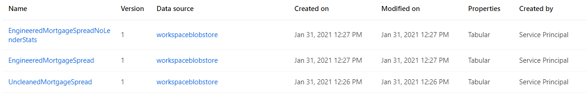


My scripts access them by logging into the Azure ML workspace using the Service Principal credentials and then searching and EngineeredMortgageSpread. 

You can access them using your own subscription ID with the code below:

```
from azureml.core import Workspace, Dataset
subscription_id = 'YOUR-SUBSCRIPTION-ID-HERE'
resource_group = 'aml_research'
workspace_name = 'aml_research'
workspace = Workspace(subscription_id, resource_group, workspace_name)
dataset = Dataset.get_by_name(workspace, name='EngineeredMortgageSpread')
dataset.to_pandas_dataframe()
```


---


## Automated ML
Our task was a regression tasks as we wanted to determine the continuous, single value **rate_spread** in our dataset, so the offset to the base loan rate at this point of time. As primary metric I chose the **r2_score** as this metric is in general well suited for regression tasks which large variance taking this into account. As our dataset is very large.  Our target column was the **rate_spread**, so the offset to the base loan rate. Because the single features vary from categorical via continous to binary values I chose auto-featurization to let AutoML detect them intelligently. As we are working with more than 70 columns and 100,000 data rows I originally defined a high timeout of 180 minutes of which the system effectively also required nearly 70. minutes. To minimize the execution time I chose a **max concurrent iterations** value of 5 which was the maximum number of five 4 vCPU machines I was able to use in a sponsored MSDN subscription. For the computation itself I chose a STANDARD_DS12_V2 with slightly increased ram space to this would not become an issue. 

The best AutoML model was an ensemble of two XGBoostingRegressors, similar to the ones I used in my custom HyperDrive model, two LightGBM and a third XGBoostingRegressor. The first two XG regressors though defined the outcome with a total weighting of 80%. The other three regressor each participated in the shared voting with about 0.066666% each.

Before the data was fed into the regression models it was prepared for the training with help of a DataTransformer to for example convert the remaining categorical data values into one hot encoded representations and to normalize the data.

The parameters for XGBoostingRegressor are a base_score of 0.5 - assuming the target labels have been normalized to a 0 to 1.0 range, a quite high eta range of 0.5 which leads to shorter runs by faster reducing the influence of each boosting step. A quite common and usually reasonable max_depth of 6... in my tries a maximum depth of 8 performed slightly better though. It samples 100% of the columns by level, 100% of the columns by node and 90% of the columns by tree - so a quite careful tree selection process. For the boosting algorithm itself it uses the classical gbtreeboster.

https://xgboost.readthedocs.io/en/latest/parameter.html


**Improvements**

When training the model with the original mortgage data it achieved a quite low score of just 0.7. By adding several statistical features to each row such as the average loan rate in a state or for a specific loan type this  value could be significantly increased. I also tried different training complexities which though did not affect the performance in the end. If I would further want to increase the accuracy of the model collecting additional, statistical data such as unemployment or state-wise base loan rates related to the single data rows would likely still further increase it's performance.

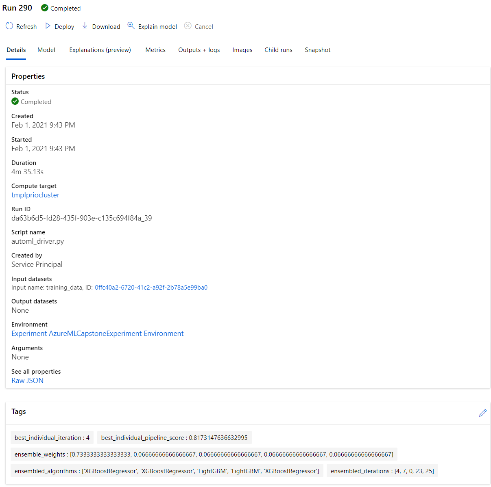

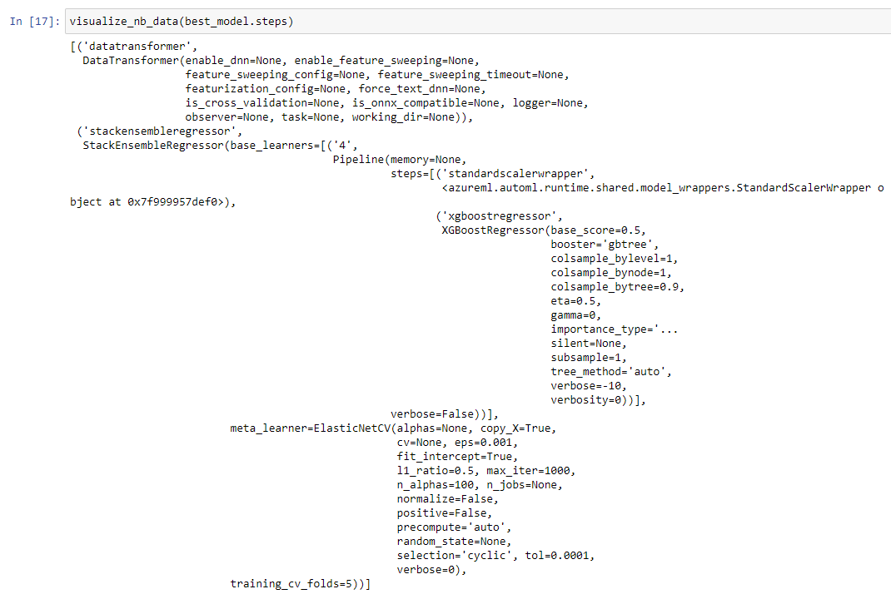


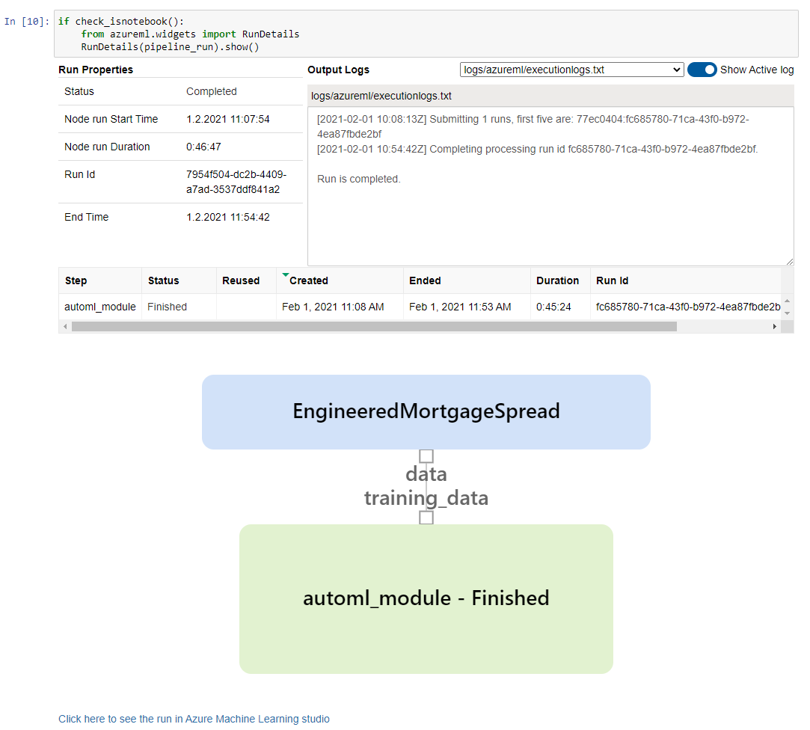


Below you can see multiple models and how they performed in comparison to each other:
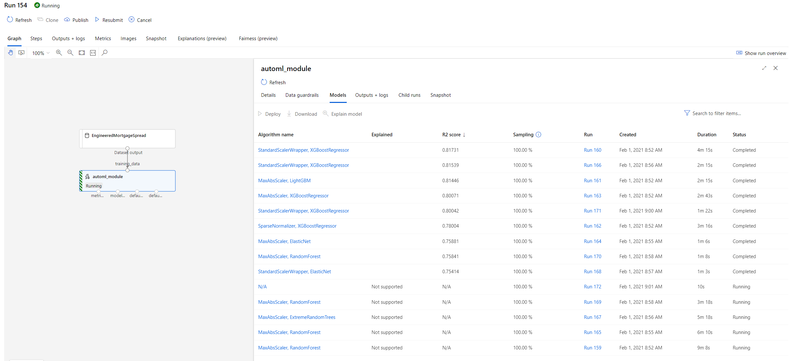


---


## Hyperparameter Tuning

I actually decided to try three different, classic algorithms for a regression task in a single script

* A linear regression model
* A fully connected neural network without an activation function, so a classic solution for a regression task
* A boosting algorithm

The script  **CustomModelTraining.py** which is later used for the training in Hyperdrive provides the following parameters:
* --lrf - type=float, default=1.0 - The learning rate factor. 1.0 = Recommended learning rate for each model type
* --dataset - type=str, default="EngineeredMortgageSpread - The name of the registered dataset to use. EngineeredMortgageSpread by default
* --models -  type=str, default="all" - The comma separated list of models to try. linear, mlpregressor, gradientboosting or all are valid values
* --iterations - type=int, default=200 - The number of neural network training iterations")
* --complexity - type=float, default=1.0 - The complexityf the models used. 1.0 = reasonable complex. Values should be between 0.0 and 4.0 and are scaled with a base value for each model type. The effective values will be returned by the script.

I let Hyperdrive iterate through all three different model types... without using the "all" option to train them one by one, five different complexity grades from 0.25 defining the depth of the neural network and the number of estimators and the depth of the boosting algorithm, 5 different learning rates from 0.1 to 2.0 and once 100 and 200 iterations for the neural network training steps.

The precise configuration was::
```
        "--model": choice('linear', 'mlpregressor', 'gradientboosting'),
        "--lrf": choice(1.0, 0.1, 0.25, 0.5, 2.0),
        "--iterations": choice(100, 200),
        "--complexity": choice(1.0, 0.25, 0.5, 2.0)
```

### Results

The best model achieved an r2-score of 0.816 with the following parameter set passed to the training script:
* --model=gradientboosting
* --lrf=2
* --complexity=2
* --iterations=200

and the following internal training parameters it generated from the relative defintions above:
```
{'Best model:': "{'estimators': 190, 'learning_rate': 0.04000000000000001, 'max_depth': 8, 'type': 'gradientboosting'}",
 'mean_sq': 0.1808336348523205,
 'rmean_sq': 0.4252453819294461,
 'mean_abs': 0.28019483113154464,
 'median_abs': 0.163840184863894,
 'r2_score': 0.8161282139834027,
 'adjr2_score': 0.815441206975645}
```

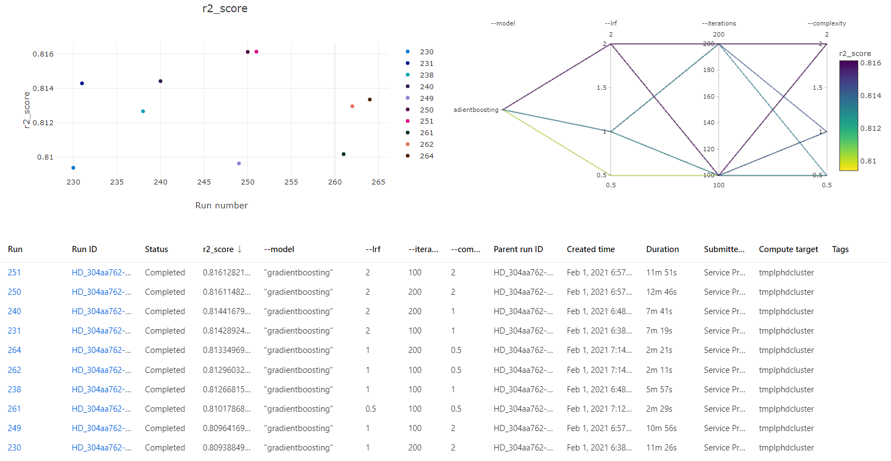

The boosting models profit visibly of a larger set of estimators and a larger depths which though also exponentially increases the optimization time. Trying even larget complexity grades had likely still slighly increased the model's performance.

Here you can find the output of the best performing model's result:
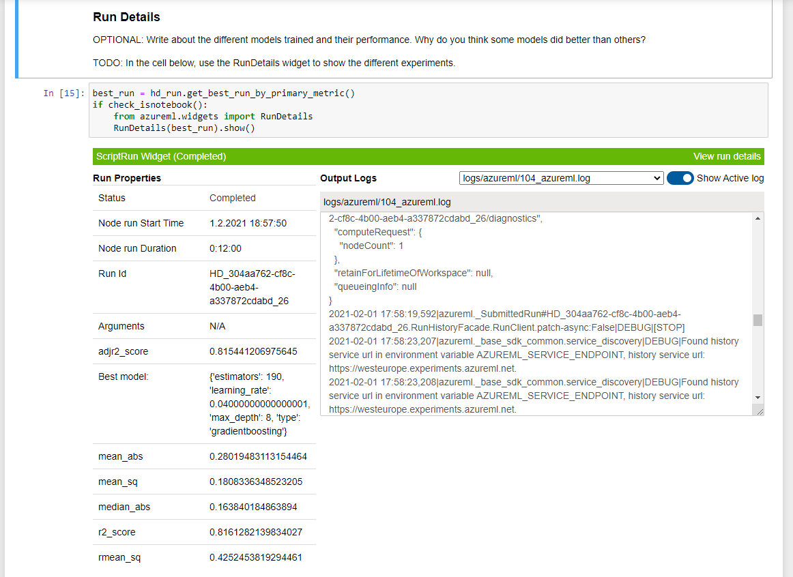


And here it's details in the Azure portal:

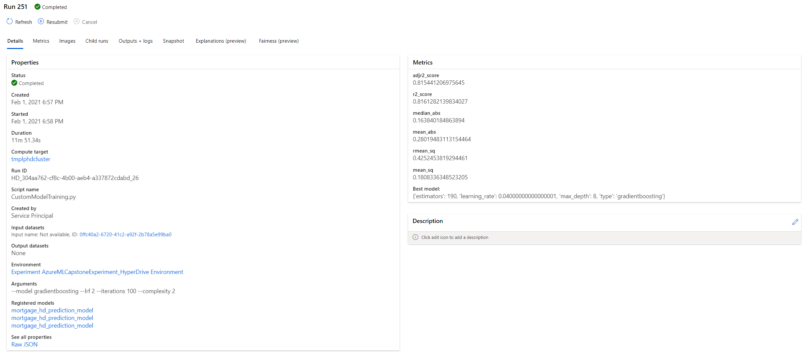


---


## Model Deployment

The model is deployed as an https web service within an Azure Container Instance and can easily be accessed using any http library such as **requests**. All you need is the endpoint's url such as `http://ca11cadc-353a-4403-843f-f91cea032e95.westeurope.azurecontainer.io/score` and the associated key which can either receive from the webservice class after the script based creation of the service or in the AzureML portal site of the endpoint.

Once you have these information all you have to do is to provide one or multiple rows in form of a Pandas dataset containing all columns except the rate_spread we want to predict and dump them into a single json string, nested in a field named 'data' of the main dictionary as show in the example below.

This dataset will be passed to the ** score.py** script which you can also find in this directory and was containerized by Azure which reconstructs the Pandas dataframe internally, passes it to the AutoML model's or or own model's predict function and returns a prediction for each row passed into the script in form of a JSON array, which can as shown in the example below easily be created by parsing the request result's text property.

```
from azureml.core import Workspace, Dataset
subscription_id = 'YOUR-SUBSCRIPTION-ID-HERE'
resource_group = 'aml_research'
workspace_name = 'aml_research'
ws = Workspace(subscription_id, resource_group, workspace_name)
dataset = Dataset.get_by_name(ws, name='EngineeredMortgageSpread')
df_test = dataset.to_pandas_dataframe().sample(50).drop(['rate_spread'], axis=1)
run_data = json.dumps({'data':df_test[0:50].to_json()})

import requests
scoring_uri = web_service.scoring_uri # Or the URL as provided in the AzureML portal's endpoint view
primary_key = web_service.get_keys()[0] # Or the key provided in the AzureML portal's endpoint view
headers = {'Content-Type': 'application/json'}
headers['Authorization'] = f'Bearer {primary_key}'
result = json.loads(requests.post(scoring_uri, headers=headers, data=run_data).text)
print(result)
```


And here you can see how the model performed... quite well I'd say :):
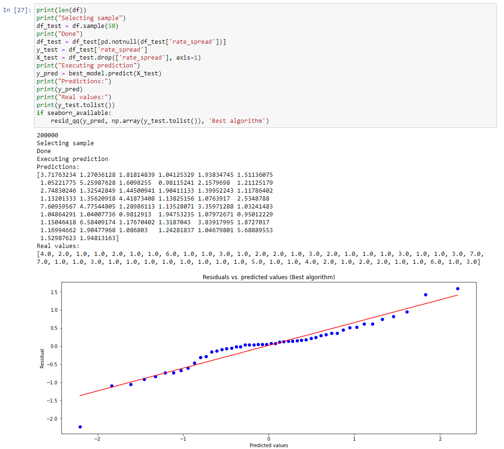


Below you can see how the deployed endpoint looks like in the AzureML portal:
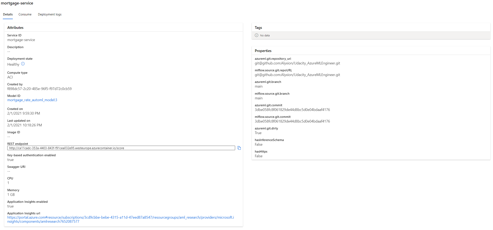

## Screen Recording
Here you can find a short presentation of my model using an http endpoint in action:

https://youtu.be/EuQ-5y8mPH0


## Future Improvements

If  I would want to further extend the performance of the model - as already mentioned above - I would try to engineer further features for each data row such as base loan rates in each state and further statistical data such as unemployment rates in different counties and current time dependent developments such as temporarily in general increasing rates. Statistical data already massively increased the performance of the model as it was presented here. As neural networks are usually not especially well suited for this task but ensembles are I would in addition definitely try even more complex compositions and validate their robustness with different training/test set samples. They take a lot of time to train (easily > 60 minutes) once they get especially deep so AutoML had not the chance to try those without betting all on a single card. I don't think that the r2-score could still be increased significantly by this approach but at least still a little bit.